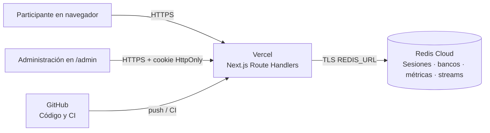
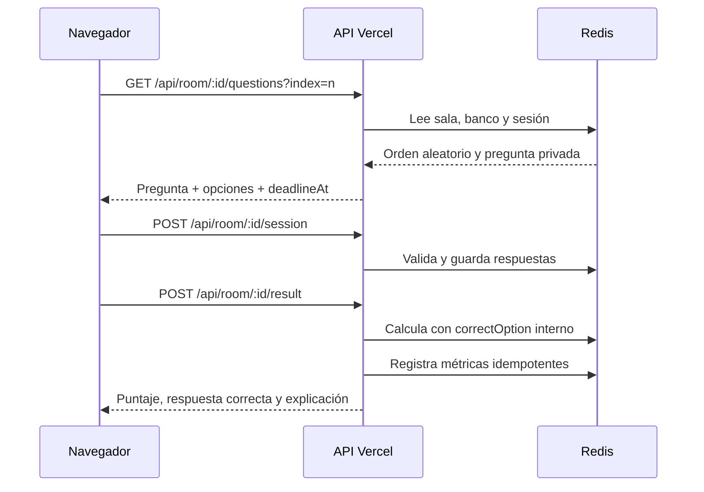

# Arquitectura de AgentPower

AgentPower es una aplicación de simulacros de certificación GCP. Una persona entra mediante un `roomId`, completa su perfil, responde preguntas aleatorias y recibe el resultado con contexto al finalizar. La administración crea salas, carga bancos bilingües y consulta métricas privadas.

## Vista general



En desarrollo, Docker Compose ejecuta Next.js y Redis local. En producción, Vercel ejecuta las funciones Node.js y Redis Cloud conserva los datos temporales. Docker no se ejecuta dentro de Vercel.

## Componentes

| Componente | Responsabilidad |
| --- | --- |
| `src/app/page.tsx` y `room-entry.tsx` | Landing y validación inicial del código de sala. |
| `src/app/room/[roomId]/page.tsx` | Flujo de ingreso, preguntas, guardado, tiempo, idioma y resultado. |
| Route Handlers en `src/app/api` | Validación server-side, autorización, sesiones, bancos, salas, resultados y presencia. |
| `src/lib/rooms.ts` | Salas, bancos, estados temporales e IDs públicos. |
| `src/lib/room-session.ts` | Sesiones por sala, cookie HttpOnly, binding y bloqueo de segundo intento. |
| `src/lib/questions.ts` | Contrato bilingüe, proyección pública y cálculo del resultado. |
| `src/lib/learning-stats.ts` | Agregados globales y por sala para capacitación. |
| `src/lib/presence.ts` y `room-presence.ts` | Heartbeats, clasificación privada y eventos Redis Streams. |
| `src/lib/admin-auth.ts` | Clave administrativa, digest en Redis y cookie HttpOnly. |
| Redis | Persistencia de JSON con TTL, límites, métricas y stream de presencia. |

## Flujos principales

### Ingreso a una sala

1. El navegador valida `roomId` contra `GET /api/room/:roomId/session`.
2. El servidor busca la sala en Redis y calcula `scheduled`, `active` o `closed` usando UTC.
3. Al confirmar nombre, apellidos y avatar, el servidor genera el token opaco y `participantId` interno.
4. La sesión guarda `roomId`, versión del banco, orden aleatorio, `startedAt` y `deadlineAt`.
5. La cookie `gcp_practice_session` es HttpOnly, SameSite Strict y Secure cuando la petición llega por HTTPS.

El cronómetro comienza en el servidor después de aceptar el formulario. Una recarga recupera la sesión mientras su TTL siga vigente.

### Preguntas y resultado



La API de preguntas usa `PublicQuestion`, que solo contiene `id`, texto y opciones. `correctOption`, explicación y fuente permanecen en el servidor/Redis. La respuesta correcta aparece únicamente en el resultado final.

### Administración y presencia

La administración se autentica con `ADMIN_DASHBOARD_KEY`. El servidor compara un digest con comparación de tiempo constante y emite una cookie administrativa HttpOnly. Las rutas administrativas tienen rate limiting adicional.

La presencia del participante se actualiza por heartbeat. `visibilityState` y `document.hasFocus()` son señales operativas; no prueban que una persona esté mirando otra pantalla. El panel recibe cambios mediante Redis Streams y SSE.

## Modelo de datos Redis

| Prefijo | Contenido | Retención |
| --- | --- | --- |
| `exam-gcp:room:` | Sala, ventana, banco y versión | 90 días |
| `exam-gcp:bank:meta:` | Nombre, certificación y versión | Administrada por panel |
| `exam-gcp:bank:data:` | Banco JSON bilingüe validado | Administrada por panel |
| `exam-gcp:room-session:` | Sesión participante y respuestas | 2 días |
| `exam-gcp:room-attempt:` | Bloqueo de segundo intento por sala/binding | 90 días |
| `practice-stats:room:` | Métricas por sala | 30 días o eliminación de sala |
| `presence-room:` | Presencia temporal por sala | 45 segundos |
| `presence-events` | Eventos para SSE | Máximo aproximado de 1000 eventos |

Las respuestas correctas no se guardan en la cookie ni en el estado público del navegador. Redis Cloud debe usar TLS y autenticación.

## Contratos HTTP relevantes

| Método | Ruta | Acceso | Uso |
| --- | --- | --- | --- |
| `GET` | `/api/room/:roomId/session` | Sala | Estado público y recuperación de sesión. |
| `POST` | `/api/room/:roomId/session` | Sesión de sala | Crear o guardar perfil/respuestas. |
| `GET` | `/api/room/:roomId/questions?index=n` | Sesión de sala | Una pregunta pública por solicitud. |
| `GET/POST` | `/api/room/:roomId/result` | Sesión finalizable | Resultado paginado y finalización. |
| `POST` | `/api/presence/room/:roomId` | Sesión de sala | Heartbeat de presencia. |
| `GET` | `/api/admin/banks`, `/api/admin/rooms` | Admin | Listar bancos y salas. |
| `POST` | `/api/admin/banks`, `/api/admin/rooms` | Admin | Crear bancos y salas. |
| `GET` | `/api/presence/stream` | Admin | SSE de presencia global. |

Las rutas globales heredadas `/api/session`, `/api/questions` y `/api/session/result` responden `410` para evitar entrar sin sala.

## Seguridad y límites

- Las entradas externas se validan en el servidor; `roomId` tiene formato estricto.
- Los cuerpos JSON tienen un límite de 5 MB.
- Las respuestas no incluyen `correctOption` durante la práctica.
- Las cookies de sesión no son accesibles desde JavaScript.
- Las métricas y presencia requieren administración o una sesión de sala válida.
- El rate limit no confía en cabeceras de IP cuando `TRUST_PROXY=false`.
- En Vercel se define `TRUST_PROXY=true` porque Vercel actúa como proxy confiable.
- Redis local se publica solo en localhost y exige contraseña.
- No se guardan secretos en Git, `.env` ni el contenido de preguntas versionado.

El bloqueo de segundo intento se basa en la vinculación temporal de IP y familia de navegador. Sin cuentas o códigos individuales, una persona puede usar otro navegador o red; esa limitación es parte del MVP.

## Despliegue

### Local

```bash
cp .env.example .env
# Configura REDIS_PASSWORD, SESSION_BINDING_SECRET y ADMIN_DASHBOARD_KEY.
docker compose up --build
```

La aplicación queda en `http://localhost:3000` y Redis solo en `127.0.0.1:6379`.

### Vercel + Redis Cloud

1. Publica el repositorio en GitHub.
2. Importa el repositorio en Vercel como proyecto Next.js.
3. Añade `REDIS_URL`, `SESSION_BINDING_SECRET`, `ADMIN_DASHBOARD_KEY` y `TRUST_PROXY=true` en Production y Preview.
4. Carga el banco desde un entorno seguro:

   ```bash
   REDIS_URL="rediss://..." npm run seed:redis
   ```

5. Despliega y prueba `/`, `/admin` y una sala real.

Vercel no ejecuta `docker-entrypoint.sh`. Si Redis aún no tiene `exam-gcp:admin-key`, la aplicación calcula el digest desde `ADMIN_DASHBOARD_KEY`; el banco sí debe sembrarse previamente en Redis Cloud.

## Operación y recuperación

- Si cambia una variable de entorno en Vercel, crea un nuevo despliegue.
- Si Redis se reinicia, verifica que el banco `exam-gcp:question-bank:v1` siga presente.
- Si una sala debe eliminarse, usa el panel para borrar sus sesiones, intentos y métricas.
- Si falla un guardado, la interfaz muestra el estado y ofrece reintentar recargando la sesión desde Redis.
- Antes de publicar cambios de contenido, ejecuta `npm run validate:content`.

## Decisiones relacionadas

- [Misión](../specs/mission.md)
- [Stack técnico](../specs/tech-stack.md)
- [Decisiones](../specs/decisions.md)
- [Requisitos del examen programado](../specs/2026-10-05-examen-programado/requirements.md)
- [Validación](../specs/2026-10-05-examen-programado/validation.md)
